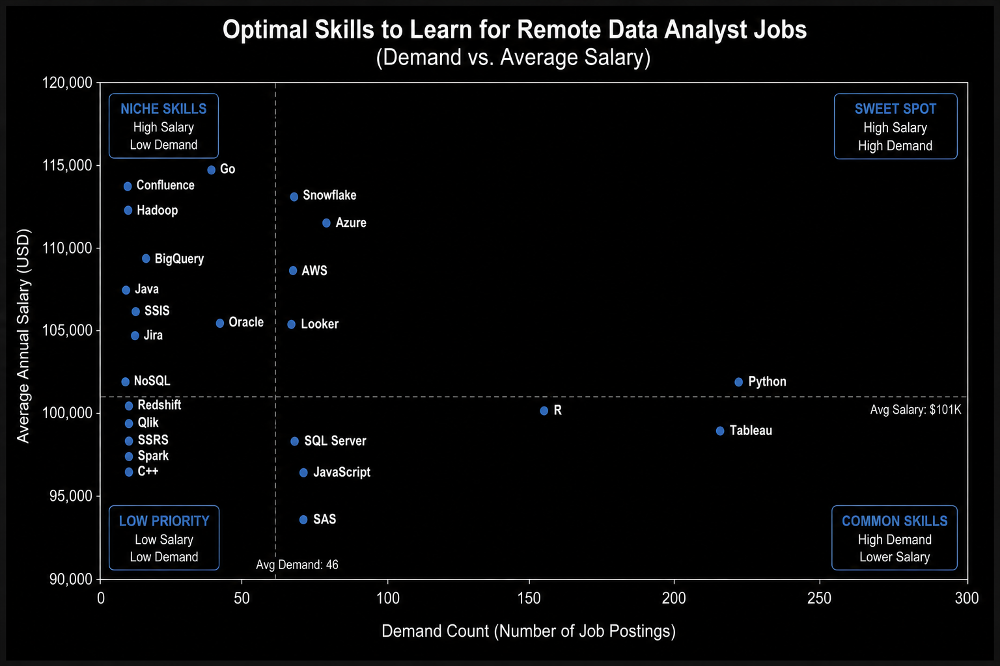
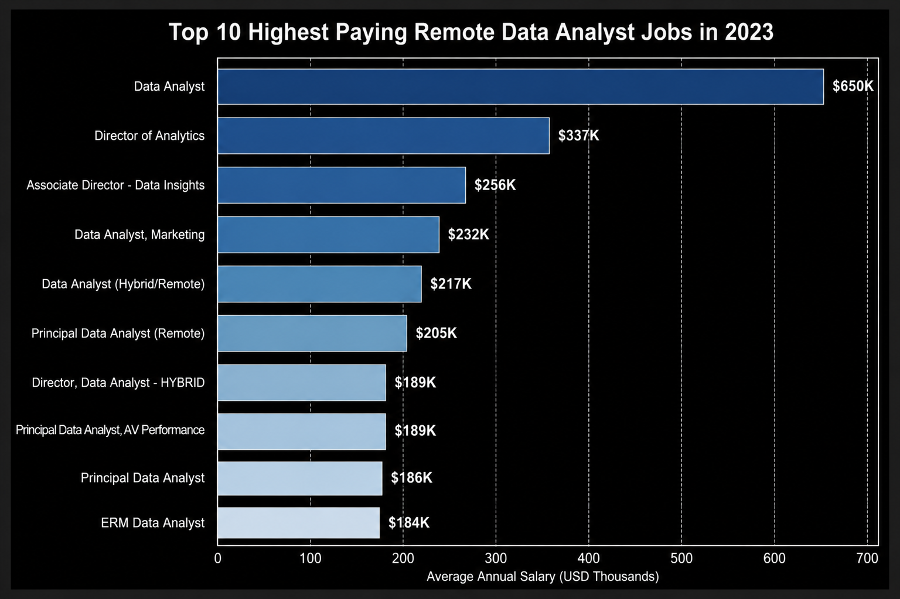
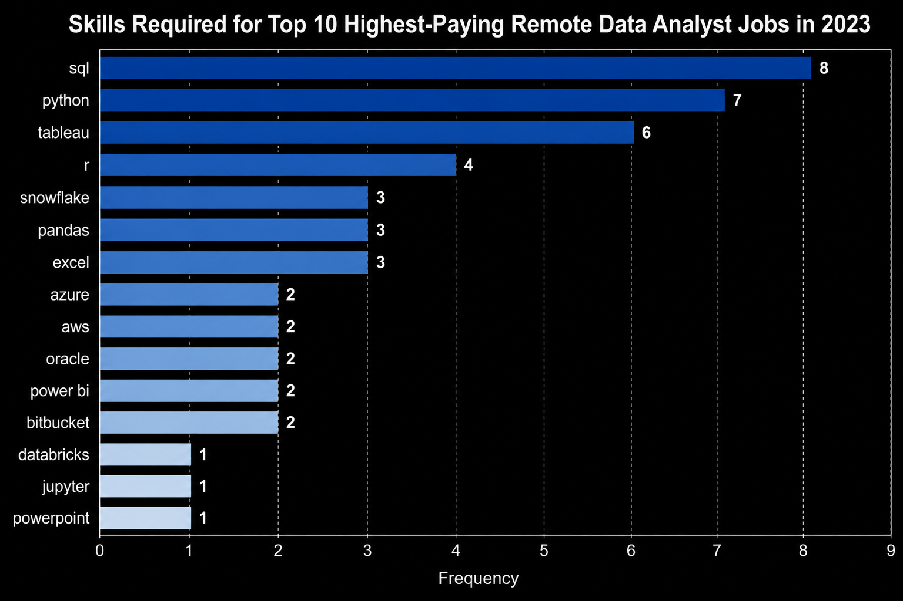
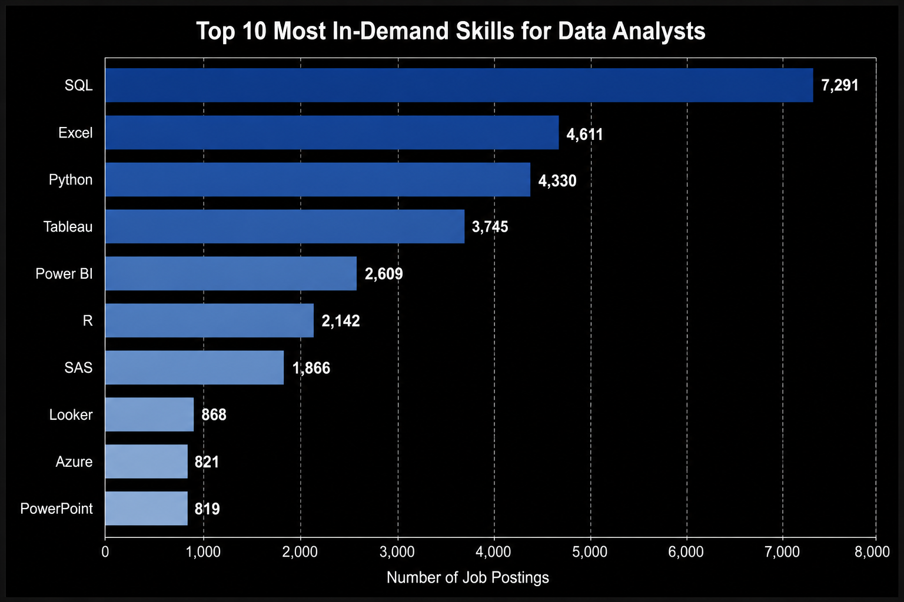
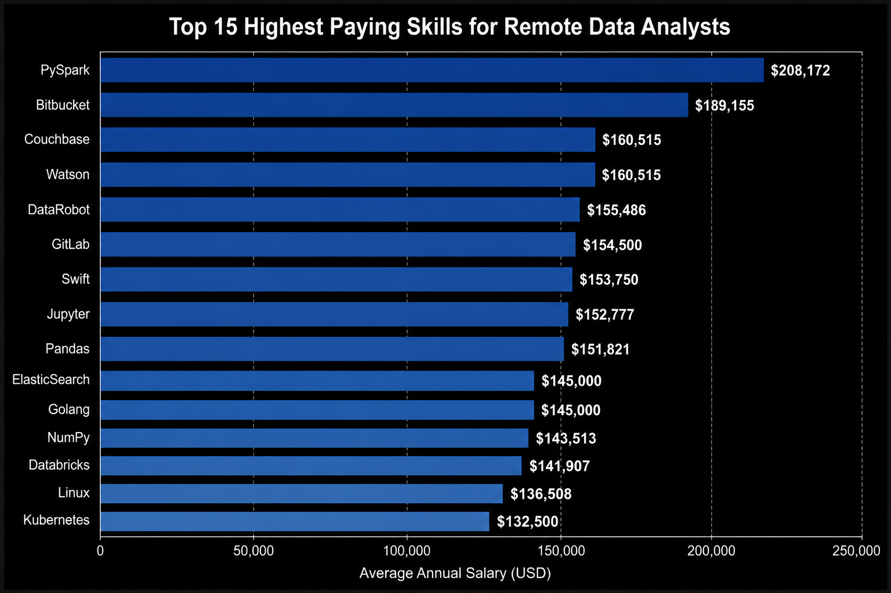

# Data Analyst Job Market Analysis with SQL



## Project Overview

This project analyzes the 2023 Data Analyst job market to identify the roles and technical skills associated with employer demand and higher salaries. Using PostgreSQL, I queried a relational database containing more than **785,000 job postings** and translated the results into practical insights for data professionals.

The analysis focuses on remote Data Analyst opportunities and answers five career-related questions:

1. What are the highest-paying Data Analyst jobs?
2. Which skills are required for the highest-paying roles?
3. Which skills are most in demand?
4. Which skills are associated with the highest salaries?
5. Which skills offer the strongest balance of demand and compensation?

## Technical Skills Demonstrated

`PostgreSQL` `SQL` `CTEs` `JOINs` `Aggregations` `GROUP BY` `HAVING` `Relational Data Modeling` `Git` `GitHub`

## Key Findings

- **SQL is the most in-demand skill**, appearing in 7,291 remote Data Analyst postings.
- **Excel, Python, Tableau, and Power BI** complete the core group of skills most frequently requested by employers.
- The highest-paying roles are concentrated in **senior, principal, and leadership-level analytics positions**.
- **Python, Tableau, and R** offer a strong combination of demand and salary potential.
- Cloud and data-platform skills such as **Snowflake, Azure, AWS, and Hadoop** are associated with competitive salaries and provide opportunities for specialization.
- Higher-paying analyst positions frequently combine analytics with programming, cloud, and data-engineering responsibilities.

## Dataset

The project uses a real-world dataset of more than **785,000 job postings** collected during 2023 and provided by [Luke Barousse](https://www.lukebarousse.com/). The postings were gathered through Google Job Search from sources including LinkedIn, Indeed, company career pages, and other job boards.

The data was cleaned and organized into four related PostgreSQL tables:

| Table | Purpose |
| --- | --- |
| `job_postings_fact` | Job titles, salaries, locations, schedules, and posting details |
| `company_dim` | Company names and company-level information |
| `skills_dim` | Skill names and categories |
| `skills_job_dim` | Bridge table connecting job postings with requested skills |

## Tools Used

- **PostgreSQL:** Database creation, storage, and analysis
- **SQL:** Querying, filtering, joining, aggregating, and ranking job-market data
- **Visual Studio Code:** SQL development and repository workspace
- **Git:** Version control
- **GitHub:** Project documentation and portfolio presentation

## Analysis

### 1. Highest-Paying Data Analyst Jobs

**Goal:** Identify the 10 highest-paying remote Data Analyst positions with reported annual salaries.

**SQL techniques:** `LEFT JOIN`, `WHERE`, `ORDER BY`, and `LIMIT`

**[View the SQL query](./project_sql/1_top_paying_jobs.sql)**



#### Findings

- The highest salaries were concentrated in senior, principal, and leadership positions.
- Director-level analytics roles demonstrate the compensation potential of combining technical expertise with management responsibilities.
- Large technology and data-driven companies were among the organizations offering the strongest compensation.
- Remote senior analysts can access high-paying opportunities without being limited to one geographic market.

#### Takeaway

Advanced analytical expertise becomes more valuable when paired with leadership, specialization, and the ability to influence business decisions.

---

### 2. Skills Required for the Highest-Paying Jobs

**Goal:** Determine which technical skills appear across the 10 highest-paying remote Data Analyst positions.

**SQL techniques:** CTE, `LEFT JOIN`, and multiple `INNER JOIN` operations

**[View the SQL query](./project_sql/2_top_paying_job_skills.sql)**



#### Findings

- SQL appeared in 8 of the 10 highest-paying roles.
- Python and Tableau appeared in 7 and 6 roles, respectively.
- R, Excel, Pandas, and Snowflake were also repeatedly requested.
- Cloud and data-platform technologies such as AWS, Azure, Databricks, and Snowflake helped distinguish senior positions.
- Collaboration and workflow tools—including Jira, Confluence, GitLab, and Bitbucket—also appeared in high-paying roles.

#### Takeaway

High-paying Data Analyst positions typically require more than one analytical tool. SQL, Python, and visualization skills form the core stack, while cloud, data-platform, and collaboration tools provide additional differentiation.

---

### 3. Most In-Demand Data Analyst Skills

**Goal:** Rank the skills that appear most frequently in remote Data Analyst postings.

**SQL techniques:** Multiple `INNER JOIN` operations, `COUNT()`, `GROUP BY`, `ORDER BY`, and `LIMIT`

**[View the SQL query](./project_sql/3_top_demanded_skills.sql)**



#### Findings

| Rank | Skill | Job Postings |
| ---: | --- | ---: |
| 1 | SQL | 7,291 |
| 2 | Excel | 4,611 |
| 3 | Python | 4,330 |
| 4 | Tableau | 3,745 |
| 5 | Power BI | 2,609 |

- SQL leads demand by a substantial margin.
- Excel remains highly relevant for analysis, reporting, and business workflows.
- Python expands an analyst's ability to automate processes and work with larger datasets.
- Tableau and Power BI confirm the importance of dashboard development and data storytelling.

#### Takeaway

The broadest Data Analyst skill foundation combines SQL, Excel, Python, and at least one major business-intelligence platform.

---

### 4. Skills Associated with the Highest Salaries

**Goal:** Identify the skills associated with the highest average annual salaries for remote Data Analyst positions.

**SQL techniques:** Multiple `INNER JOIN` operations, `AVG()`, `ROUND()`, `GROUP BY`, `ORDER BY`, and `LIMIT`

**[View the SQL query](./project_sql/4_top_paying_skills.sql)**



#### Findings

- PySpark was associated with the highest average salary among the skills analyzed.
- Databricks, Airflow, Kubernetes, Elasticsearch, and Golang indicate a salary premium for modern data infrastructure skills.
- Pandas, NumPy, Scikit-learn, Jupyter, and DataRobot show the growing overlap between analytics, data science, and machine learning.
- DevOps and collaboration technologies also appeared among high-paying skill combinations.

#### Takeaway

The highest-paying analyst opportunities frequently blend traditional analysis with programming, cloud platforms, data engineering, and production-oriented workflows.

---

### 5. Optimal Skills Based on Demand and Salary

**Goal:** Find skills that balance employer demand with strong average salary potential.

**SQL techniques:** Multiple CTEs, `COUNT()`, `AVG()`, `INNER JOIN`, `GROUP BY`, `HAVING`, and multi-column sorting

To reduce the effect of very small samples, this analysis includes only skills appearing in more than 10 qualifying postings.

**[View the SQL query](./project_sql/5_optimal_skills.sql)**


#### Findings

- Python provides one of the strongest combinations of demand and compensation.
- Tableau and R offer broad demand while maintaining competitive salary levels.
- Snowflake, Azure, AWS, and Go provide higher-paying opportunities for specialization.
- Enterprise tools such as Confluence, Hadoop, BigQuery, and Looker can help candidates stand out in specific data environments.

#### Takeaway

The strongest learning strategy combines widely requested core tools with a smaller number of valuable specializations. Demand and salary should be evaluated together rather than independently.

## What I Learned

This project strengthened my ability to:

- Write analytical SQL using **CTEs, multi-table JOINs, aggregate functions, GROUP BY, HAVING, filtering, and sorting**
- Navigate and analyze a relational database containing fact, dimension, and bridge tables
- Translate career questions into structured SQL queries
- Compare demand and salary while accounting for minimum sample sizes
- Convert query results into clear findings and actionable recommendations
- Use Git and GitHub to document and publish a complete analytics project

## Limitations

- Salary information was not available for every job posting.
- Salary averages do not independently control for seniority, industry, company size, or geographic differences.
- Skills appearing in fewer postings may produce less stable salary estimates.
- The analysis identifies associations between skills and compensation, not direct causation.
- The dataset represents postings collected during 2023 and does not necessarily reflect current market conditions.
- Duplicate, expired, or inconsistently categorized postings may exist in aggregated job-board data.

## How to Run the Project

1. Install PostgreSQL and a SQL client such as pgAdmin or Visual Studio Code.
2. Create the database using [`1_create_database.sql`](./sql_load/1_create_database.sql).
3. Create the tables and relationships using [`2_create_tables.sql`](./sql_load/2_create_tables.sql).
4. Download the dataset from the source linked above.
5. Update the placeholder CSV paths in [`3_modify_tables.sql`](./sql_load/3_modify_tables.sql).
6. Import the four CSV files into their corresponding PostgreSQL tables.
7. Run the numbered files in the [`project_sql`](./project_sql/) folder in sequence.

## Repository Structure

```text
SQL_Project_Data_Job_Analysis/
├── assets/                  # Charts and project visuals
├── project_sql/             # Five analytical SQL queries
│   ├── 1_top_paying_jobs.sql
│   ├── 2_top_paying_job_skills.sql
│   ├── 3_top_demanded_skills.sql
│   ├── 4_top_paying_skills.sql
│   └── 5_optimal_skills.sql
├── sql_load/                # Database creation and data-loading scripts
├── .gitignore
└── README.md
```

## Conclusion

This project demonstrates how SQL can transform a large relational dataset into practical job-market insights. By analyzing compensation and employer demand together, I identified both the foundational tools that qualify candidates for the greatest number of Data Analyst opportunities and the specialized technologies associated with stronger earning potential.

The project also demonstrates an end-to-end analytical process: defining questions, querying related tables, validating the scope of the results, communicating limitations, and presenting findings in a way that supports career decisions.

## Acknowledgment

The 2023 data jobs dataset used in this project was provided by [Luke Barousse](https://github.com/lukebarousse/SQL_Project_Data_Job_Analysis).
